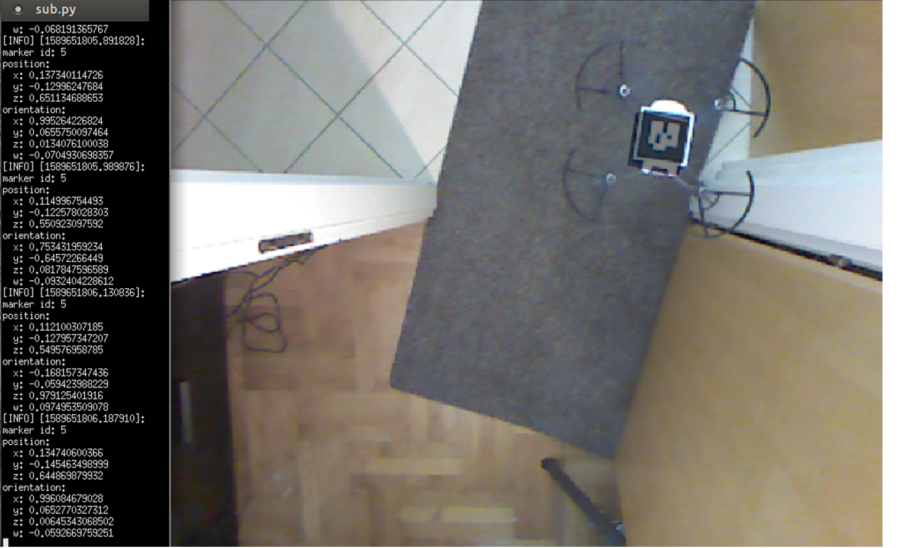

# Završni rad
##Određivanje položaja i praćenje bespilotnih letjelica pomoću RGB kamera

###Preduvjeti

* [ROS Melodic](https://wiki.ros.org/melodic)
* Python
* [ROS paket 'openni\_camera'](https://wiki.ros.org/openni_camera)
* [ROS paket 'ar\_track\_alvar'](https://wiki.ros.org/ar_track_alvar)
* [ROS paket 'rviz'](https://wiki.ros.org/rviz)
* Microsoft Kinect XBOX 360 kamera

###Instalacija
Kreirati buduće radno okruženje i klonirati repozitorij
```
mkdir <workspace>
cd <workspace>
git clone https://github.com/matildabenac/zavrsni_rad
```
Napraviti build za radno okruženje
```
catkin_make
source <workspace>/devel/setup.bash
```

###Pokretanje
```
cd <workspace>
roslaunch ar_track_launch/launch/kinect_ar_track_alvar.launch
```


